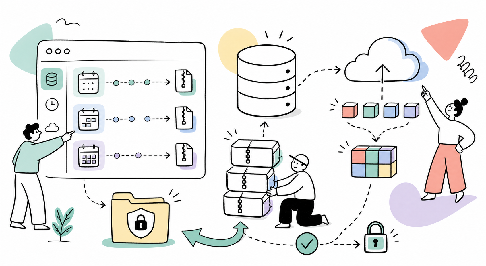

# ProcessDbBackup

Database backup and restore module for ProcessWire 3.x.



Supports local storage and Backblaze B2, three independent backup schedules (regular / weekly / monthly), chunked upload for large files, streaming restore, and a dashboard widget on the admin home page.

**Author:** Maxim Semenov  
**Website:** [smnv.org](https://smnv.org)  
**Email:** [maxim@smnv.org](mailto:maxim@smnv.org)

If this project helps your work, consider supporting future development: [GitHub Sponsors](https://github.com/sponsors/mxmsmnv) or [smnv.org/sponsor](https://smnv.org/sponsor/).  

## Features

- **One-click backup** from the Admin UI with AJAX progress bar
- **Three backup types** — regular, weekly, monthly — each with independent LazyCron schedule and retention count
- **Admin home widget** — shows status, latest backup date and storage for each type, with "Create now" button per type
- **Backblaze B2** optional cloud upload (API v3) for all backup types
- **Configurable local copy** — keep or delete local file after B2 upload
- **Chunked upload** — upload `.sql.gz` from your computer in 2MB chunks, bypasses `upload_max_filesize`
- **Streaming restore** — PDO restore reads line-by-line, memory usage stays flat regardless of dump size
- **Lock file** — prevents concurrent backup processes
- **Verify integrity** — gzip check + SQL structure validation before any restore
- **Partial restore** — select individual tables to restore from a backup
- **Pre-restore auto-backup** — creates a safety backup of the current DB before any restore
- **Exclude tables** — skip specific tables (e.g. cache, sessions) from all backups
- **Database table sizes** — dashboard section showing largest tables, row estimates, data/index size, and backup inclusion status
- **Git-tracked deployment migrations** — generate and run PHP migration files from a GUI section, with an execution log and optional pre-migration backup
- **Schema snapshots** — export fields, templates, permissions, and roles as JSON and compare the latest snapshot with the current schema
- **Inline labels** — add notes to any backup entry directly in the table
- **Sort and filter** — sort by filename/date/size, filter by backup type
- **Protected storage** — `site/assets/backups/db/` with `.htaccess` deny-all
- **Meta-driven list** — B2-only backups appear in the UI even without a local file
- Module log at `Setup → Logs → db-backup`

## Requirements

- ProcessWire ≥ 3.0.0
- PHP ≥ 8.0
- PHP extensions: `zlib`, `PDO`, `curl` (curl required for B2 only)
- `mysqldump` / `mysql` CLI — optional but recommended for large databases
- LazyCron module — required for scheduled backups

## Installation

1. Copy the `ProcessDbBackup/` folder to `site/modules/`
2. In **Admin → Modules**, click **Refresh** and install **ProcessDbBackup**
3. The admin page is created automatically at **Admin → DB Backup**
4. Assign the `db-backup` permission to roles that need access

## Configuration

Go to **Admin → Modules → Configure → ProcessDbBackup**.

### General

| Setting | Description |
|---|---|
| Max backups (retention) | Auto-delete oldest regular backups beyond this count. `0` = unlimited |
| Auto-backup before restore | Creates a safety backup before any restore operation |
| Exclude tables | One table name per line — skipped in all backups |

### Schedules

Three independent fieldsets: **Regular**, **Weekly**, **Monthly**.

| Setting | Description |
|---|---|
| Schedule | LazyCron interval for this backup type |
| Keep (N backups) | Retention count for this type independently |

**Regular** — for frequent backups (hourly, daily). Outdated status triggers after 2 days without a backup.

**Weekly** — for weekly snapshots. Outdated status triggers after 7 days.

**Monthly** — for long-term archival. Outdated status triggers after 28 days.

### Available LazyCron intervals

`every30Seconds` · `everyMinute` · `every2Minutes` · `every3Minutes` · `every4Minutes` · `every5Minutes` · `every10Minutes` · `every15Minutes` · `every30Minutes` · `every45Minutes` · `everyHour` · `every2Hours` · `every4Hours` · `every6Hours` · `every12Hours` · `everyDay` · `every2Days` · `every4Days` · `everyWeek` · `every2Weeks` · `every4Weeks`

LazyCron fires on the next page load after the interval has elapsed.

### Backblaze B2

| Setting | Description |
|---|---|
| Enable B2 upload | Upload every backup (all types) to B2 after creation |
| Keep local copy | Checked: keep local file and upload to B2. Unchecked: delete local after successful B2 upload |
| Application Key ID | From your B2 App Keys |
| Application Key | Secret portion (shown once at creation) |
| Bucket ID | Found on the B2 bucket overview page |
| Path prefix | Optional subfolder, e.g. `mysite/db-backups` |

The module uses **B2 API v3**. Required App Key capabilities: `readFiles`, `writeFiles`, `listFiles`, `deleteFiles`.

## Admin home widget

The widget appears at the top of **Admin → Dashboard** and shows a table with one row per backup type:

| Column | Content |
|---|---|
| Type | Regular / Weekly / Monthly |
| Status | 🟢 OK · 🟡 Outdated · 🔴 No backups |
| Latest backup | Date and storage badge (Local / B2 only / Local+B2) |
| Count | Number of backups of this type |
| Schedule | Configured LazyCron interval |
| Action | **Create now** button — creates a backup of that type immediately |

Status thresholds: Regular → 2 days · Weekly → 7 days · Monthly → 28 days.

Only visible to users with the `db-backup` permission.

## Backup types and file naming

| Type | Filename prefix | Default retention |
|---|---|---|
| Regular | `db-YYYY-MM-DD_HHiiss.sql.gz` | 10 |
| Weekly | `db-weekly-YYYY-MM-DD_HHiiss.sql.gz` | 4 |
| Monthly | `db-monthly-YYYY-MM-DD_HHiiss.sql.gz` | 3 |
| Uploaded | `db-uploaded-YYYY-MM-DD_HHiiss.sql.gz` | — |

Retention is enforced per type independently after each backup creation.

## Storage modes

| Mode | Local file | B2 | Download / Restore |
|---|---|---|---|
| Local only | ✅ | — | Available |
| Local + B2 | ✅ | ✅ | Available |
| B2 only | — | ✅ | Disabled (tooltip shown) |

The backup list is driven by `.meta.json`. B2-only entries are visible in the UI with a **B2 only** badge.

## File locations

```
site/assets/backups/db/              — backup directory (htaccess protected)
site/assets/backups/db/.meta.json    — metadata for all backups
site/assets/backups/db/.lock         — cron lock file (auto-removed)
site/assets/backups/db/.chunks/      — temporary chunk storage during upload
site/modules/ProcessDbBackup/migrations/ — Git-tracked deployment migrations
site/modules/ProcessDbBackup/migrations/snapshots/ — Git-tracked schema snapshots
```

## Backup methods

1. **mysqldump** (preferred) — `--single-transaction --quick` for InnoDB-safe hot backups, output piped through `gzip`
2. **PHP PDO** (fallback) — exports tables row-by-row in 100-row INSERT batches, written directly to `.gz` via `gzopen`

## Restore

Restore **overwrites the database**. A confirmation dialog is shown before proceeding.

**Full restore** methods (tried in order):
1. `mysql` CLI — pipes decompressed dump into `mysql`
2. PHP PDO streaming — reads `.gz` line-by-line, executes statements one at a time

**Partial restore** — select individual tables from the backup. Shows each table with a status badge (exists / new) and a "select all" checkbox.

Restore is only available for backups with a local copy. B2-only backups must be downloaded manually first.

## Deployment migrations

The **DB Backup → Migrations** section generates and runs Git-tracked PHP migration files from:

```text
site/modules/ProcessDbBackup/migrations/
```

This is intended for ProcessWire schema/deployment changes such as creating fields, updating templates, adding permissions, installing modules, or creating system pages. It is not intended to restore live content from local development.

Each migration file is applied once and recorded in the `process_db_backup_migrations` table with filename, checksum, user, timestamp, optional message, and pre-migration backup filename.

The GUI generator can create starter migrations for:

- Creating fields
- Creating templates
- Adding a field to a template
- Installing a module
- Creating permissions
- Creating roles

Generated files are intentionally plain PHP so they can be reviewed, edited, committed, and reused during deployment.

Migration files can be previewed from the GUI before running. The preview shows the file contents, checksum, current applied/pending state, and a warning when generated code contains manual-review comments.

### Schema snapshots

The migrations screen can also create JSON schema snapshots in:

```text
site/modules/ProcessDbBackup/migrations/snapshots/
```

Snapshots include ProcessWire field definitions, template field assignments, permissions, and roles. They intentionally exclude pages, field values, users, sessions, caches, and uploads.

The latest snapshot is compared against the current schema and the UI shows added, removed, and changed schema items. This makes it easier to notice when a local schema change still needs a migration file before deployment.

When the diff contains added schema items, the UI can generate a starter migration from the latest snapshot diff. Added fields, templates, permissions, and roles are converted to PHP migration code. Changed and removed items are left as comments for manual review.

Example:

```php
<?php namespace ProcessWire;

$field = $fields->get('recipe_time');
if (!$field->id) {
	$field = new Field();
	$field->name = 'recipe_time';
	$field->type = $modules->get('FieldtypeInteger');
	$field->label = 'Recipe time';
	$fields->save($field);
}

$template = $templates->get('recipe');
if ($template->id && !$template->fieldgroup->hasField($field)) {
	$template->fieldgroup->add($field);
	$fieldgroups->save($template->fieldgroup);
}

return 'Recipe fields migrated.';
```

Recommended workflow:

1. Pull a fresh production backup to local before starting work.
2. Commit template/module/file changes and migration files together.
3. Upload files to production.
4. Open **DB Backup → Migrations** and run pending migrations.
5. Keep **Auto-backup before restore** enabled so a safety backup is created before each migration.

## Chunked upload

The upload form on the DB Backup page sends the file in **2MB chunks** via JavaScript `Fetch` API. Each chunk is saved to `.chunks/` on the server and assembled into the final file once all chunks arrive. This bypasses PHP's `upload_max_filesize` and `post_max_size` limits entirely — any file size works.

After assembly, the file is validated (gzip magic bytes) and added to the backup list. The **Restore immediately** checkbox triggers a full restore right after upload.

## Lock file

When a backup starts, a `.lock` file is written with the current timestamp. If a subsequent process finds the lock file and it is less than 1 hour old, the backup is skipped. Locks older than 1 hour are considered stale and removed automatically. The lock is always removed on success or cron error.

## Changelog

See [CHANGELOG.md](CHANGELOG.md).
